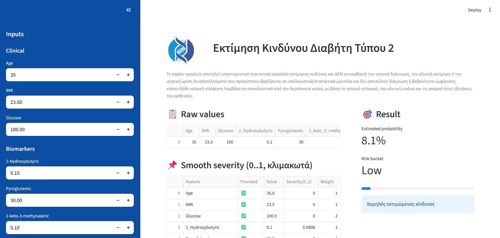
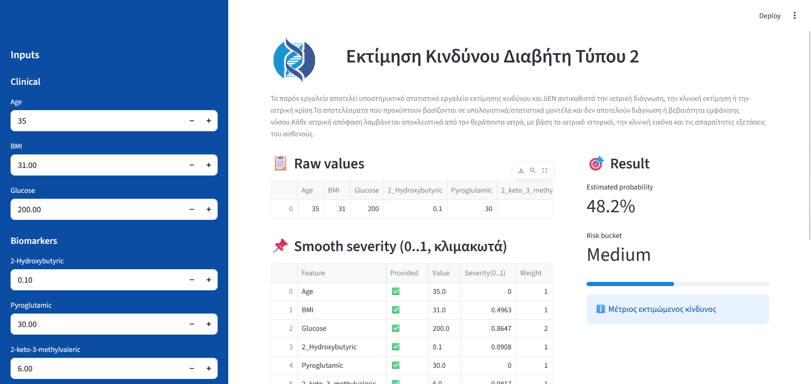
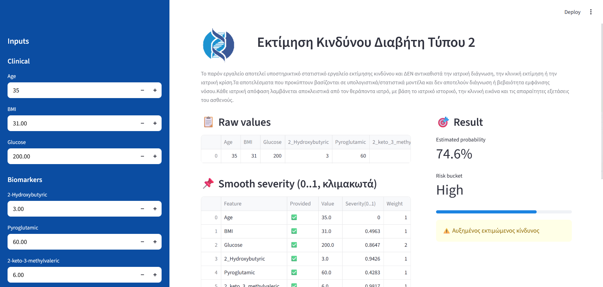

# Type 2 Diabetes Risk Assessment App

A Streamlit-based educational application for Type 2 Diabetes risk assessment using clinical and biomarker values.

The app allows users to enter clinical and biomarker data and returns an estimated probability, a Low / Medium / High risk bucket, and a smooth severity score for each feature.

## ⚠️ Disclaimer

This project is for educational and research purposes only.  
It does not provide medical diagnosis and does not replace professional medical advice, clinical evaluation, or medical judgment.

## 📌 Overview

This application was developed as a practical machine learning / statistical risk assessment project.

It includes:
- Clinical input fields
- Biomarker input fields
- Estimated probability calculation
- Low / Medium / High risk classification
- Smooth severity score table
- Greek user interface
- Medical disclaimer section

## 🖼️ Screenshots

### Low Risk Example

### Medium Risk Example

### High Risk Example

## 🛠️ Technologies Used

- Python
- Streamlit
- Pandas
- NumPy
- Joblib

## 🔒 Source Code

The full source code, model configuration, and dataset are kept private to protect the project logic and data structure.

Technical overview and source code can be shared upon request.

## 📚 What I Learned

- Building an interactive data application with Streamlit
- Working with clinical-style and biomarker-based inputs
- Creating a structured risk classification workflow
- Designing a clean user interface for a health-related tool
- Presenting a technical project safely as a public showcase
